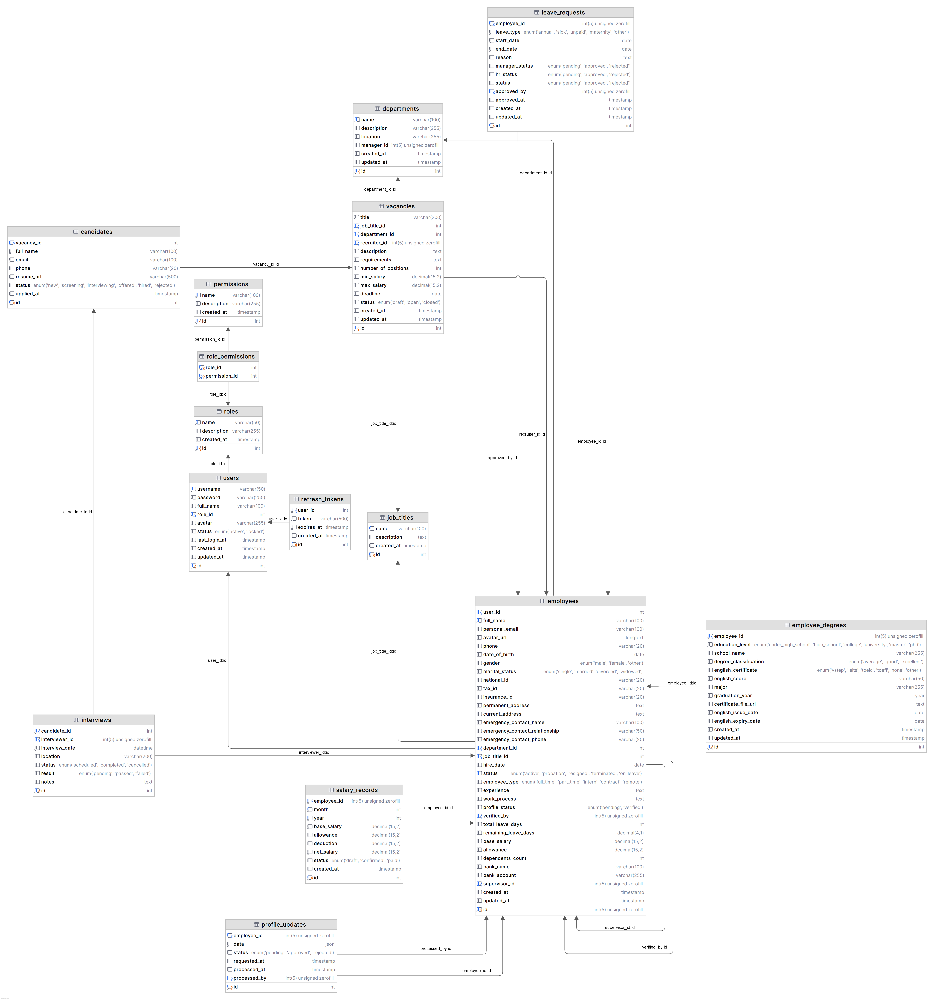

<h2>HỆ THỐNG QUẢN LÝ NHÂN SỰ - Nhóm 8 - Kỳ 2 2026 - ĐH Phenikaa</h2>

1. GIỚI THIỆU: Dự án là nền tảng quản trị nhân sự toàn diện, hỗ trợ quản lý hồ sơ nhân viên, quy trình tuyển dụng và phân quyền hệ thống.

2. CÔNG NGHỆ SỬ DỤNG

- Frontend: React.js (Vite), Zustand, Anime.js.
- Backend: Node.js (Express), xác thực qua JWT & HttpOnly Cookie.
- Database: MySQL (Cloud hosted on Aiven).
- DevOps: Docker & Docker Compose, Deployment qua Render và Vercel.
- Công cụ hỗ trợ: ngrok (Tunneling phục vụ demo và kiểm thử).

3. CÁC TÍNH NĂNG CHÍNH

- Bảo mật và Xác thực:

  - Xác thực: Sử dụng cơ chế Double Token (Access Token & Refresh Token) lưu trữ an toàn trong HttpOnly Cookie để chống lại các cuộc tấn công XSS (Cross-Site Scripting).
  - Phân quyền (RBAC): Hệ thống phân quyền chặt chẽ dựa trên vai trò (Admin, Manager, HR, Employee) thông qua Middleware kiểm tra quyền hạn (checkPermission).
  - Chống CSRF: Cấu hình CORS giới hạn domain truy cập và sử dụng Helmet.js để thiết lập các HTTP Header bảo mật (Content Security Policy, X-Frame-Options,...).
  - Quản lý phiên: Cơ chế Logout xóa cookie máy chủ và Rate Limiting ngăn chặn tấn công Brute Force.

- Quản lý Tuyển dụng (Recruitment):

  - Công khai (Public): Xem danh sách tin tuyển dụng, xem chi tiết tin và thực hiện nộp hồ sơ ứng tuyển (tạo Candidate).
  - Nội bộ (Private): Quản lý quy trình tuyển dụng (phê duyệt tin, lọc ứng viên, lên lịch phỏng vấn) dành riêng cho HR và Manager.

- Quản lý Nhân sự (Employee Management):

  - Cá nhân (Self-service): Nhân viên đăng nhập có quyền xem và tự cập nhật thông tin cá nhân cơ bản của mình.
  - Nội bộ (Private): Các thao tác quản lý (Thêm mới nhân viên, điều chỉnh lương, quản lý nghỉ phép, xem danh sách toàn công ty) được bảo vệ nghiêm ngặt bằng quyền truy cập cụ thể cho từng bộ phận.

- Tối ưu hệ thống: Sử dụng Connection Pooling để duy trì và tái sử dụng các kết nối cơ sở dữ liệu, giúp giảm độ trễ và tăng khả năng chịu tải.

- AI Integration (Nhánh ver2): Tích hợp DeepSeek API hỗ trợ tự động phân tích CV và tóm tắt yêu cầu công việc (đang trong giai đoạn phát triển).

4. THIẾT KẾ DATABASE



5. HƯỚNG DẪN CHẠY DỰ ÁN (Cross-platform)

- Cách 1: Sử dụng Docker (Khuyên dùng cho mọi hệ điều hành)
  Đảm bảo đã cài đặt Docker Desktop. Chạy lệnh tại thư mục gốc:

  ```bash
  docker-compose up --build
  ```
- Cách 2: Chạy thủ công (Linux, macOS, Windows)
  Yêu cầu: Node.js (v18+) và npm installed.

  Bước 1: Cấu hình Backend

  ```bash
  cd backend
  npm install
  npm run init   # Khởi tạo database & dữ liệu mẫu
  npm run dev    # Chạy server tại port 5001
  ```

  Lưu ý: Trên Linux/macOS, nếu gặp lỗi quyền truy cập khi install, sử dụng `sudo` hoặc kiểm tra lại quyền thư mục.

  Bước 2: Cấu hình Frontend

  ```bash
  cd frontend
  npm install
  npm run dev    # Chạy ứng dụng tại port 3000
  ```

6. LIÊN HỆ: 24100093@st.phenikaa-uni.edu.vn
